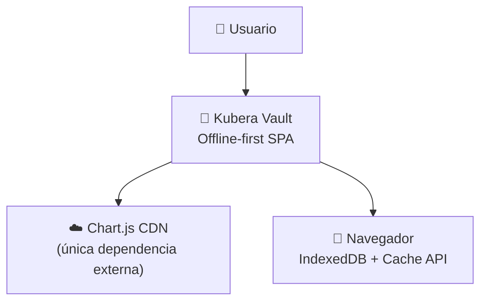
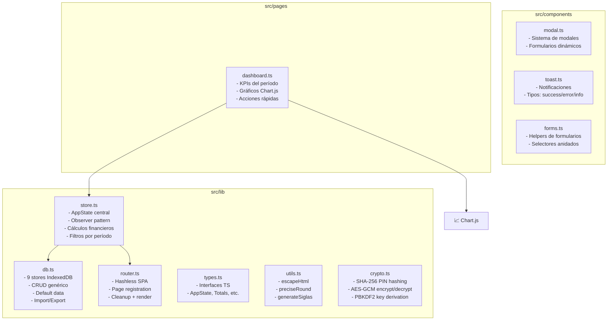
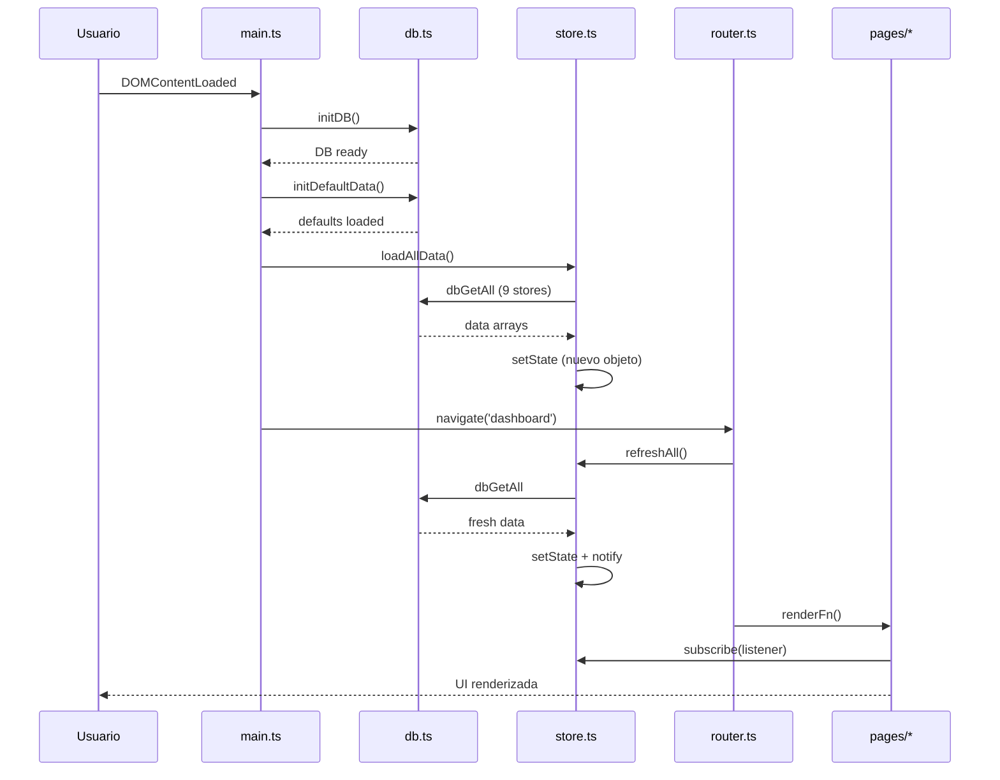
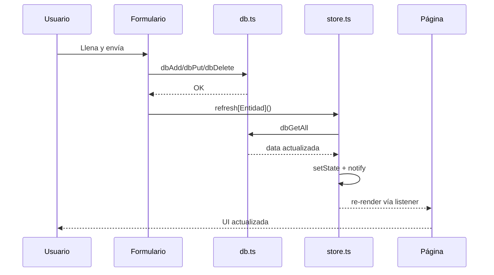

# Kubera Vault — Arquitectura

## Resumen

Kubera Vault es una aplicación de gestión de finanzas personales **offline-first**, sin backend, que ejecuta toda la lógica en el navegador. Los datos se almacenan localmente mediante IndexedDB, y la aplicación funciona como una SPA (Single Page Application) construida con TypeScript y Vite.

## Stack Tecnológico

| Capa | Tecnología |
|------|-----------|
| Lenguaje | TypeScript 6 (strict mode) |
| Bundler | Vite 8 |
| Almacenamiento | IndexedDB (9 object stores) |
| Gráficos | Chart.js 4 via CDN |
| PWA | Service Worker + Manifest |
| UI | HTML5 + CSS3 (vanilla, sin framework) |
| Estilos | Design tokens con CSS custom properties |
| Módulos | ES Modules nativos |

## Diagrama de Arquitectura (C4)

### Contexto (L1)



### Contenedores (L2)

```mermaid
graph TD
    Browser["🌐 Navegador"] --> AppShell["📄 index.html<br/>Shell de la app"]
    AppShell --> SW["⚙️ sw.js<br/>Service Worker"]
    AppShell --> CSS["🎨 css/*<br/>Design System"]
    AppShell --> TS["📦 src/main.ts<br/>Entry Point Vite"]
    TS --> Lib["🧠 src/lib/<br/>DB · Store · Router · Types · Utils"]
    TS --> Components["🧩 src/components/<br/>Modal · Toast · Forms"]
    TS --> Pages["📋 src/pages/<br/>Dashboard"]
    TS --> Legacy["🔄 js/pages/* (legacy)"]
    Lib --> IndexedDB["💾 IndexedDB<br/>KuberaVaultDB"]
    Lib --> Store["📊 Store<br/>Estado central + Observer"]
    Lib --> Router["🧭 Router<br/>Navegación SPA"]
    Pages --> ChartJS["📈 Chart.js<br/>Gráficos CDN"]
```



### Componentes (L3)



## Principios Arquitectónicos

### 1. Offline-first (sin backend)
Toda la lógica de negocio y datos residen en el navegador. No hay llamadas a servidores externos (excepto Chart.js cargado vía CDN). La aplicación es completamente funcional sin conexión a internet.

### 2. Inmutabilidad del Estado
El `Store` nunca muta el estado existente. Cada actualización crea un nuevo objeto mediante `{ ...state, ...updates }` y notifica a los suscriptores.

```typescript
// store.ts — inmutabilidad garantizada
setState(updates: Partial<AppState>): void {
  this.state = { ...this.state, ...updates };
  this.notify();
}
```

### 3. Observer Pattern para Reactividad
El Store implementa un patrón Observer simple: los componentes se suscriben con `subscribe(listener)` y reciben notificaciones cuando el estado cambia.

### 4. Event Delegation
En vez de asignar event listeners a elementos individuales, se usa delegación de eventos en el documento (`document.addEventListener('change', handler)`), evaluando `target.matches()` para determinar el origen.

### 5. ES Modules sin Framework
TypeScript compila a ES Modules nativos. No se usan frameworks de UI (React, Vue, etc.). Todo se renderiza mediante manipulación directa del DOM.

## Flujo de Datos

### Inicialización



### CRUD (Crear/Actualizar/Eliminar)



## Estructura de Carpetas

```
kubera-vault/
├── .github/workflows/       ← CI/CD
│   └── ci.yml
├── assets/icons/            ← Iconos PWA (192x192, 512x512)
├── css/
│   ├── variables.css        ← Design tokens
│   ├── base.css             ← Layout, sidebar, header
│   ├── components.css       ← Botones, inputs, modales
│   ├── pages.css            ← Estilos generales de páginas
│   └── pages/               ← Estilos por página
├── js/                      ← Código legacy (cargado dinámicamente)
│   ├── db.js
│   ├── store.js
│   ├── router.js
│   ├── app.js
│   ├── components/
│   │   ├── modal.js
│   │   ├── toast.js
│   │   └── forms.js
│   ├── pages/               ← 9 páginas legacy
│   └── importers/
├── public/
│   └── legacy/              ← Archivos legacy para build
├── src/                     ← Código moderno (TypeScript + Vite)
│   ├── main.ts              ← Entry point
│   ├── global.d.ts          ← Declaraciones globales
│   ├── lib/
│   │   ├── db.ts            ← IndexedDB wrapper
│   │   ├── store.ts         ← Estado central + observer
│   │   ├── router.ts        ← Navegación SPA
│   │   ├── types.ts         ← Interfaces y tipos
│   │   └── utils.ts         ← Utilidades
│   ├── components/
│   │   ├── modal.ts
│   │   ├── toast.ts
│   │   └── forms.ts
│   ├── pages/
│   │   └── dashboard.ts     ← Dashboard (migrado a TS)
│   └── importers/
├── vendor/                  ← Librerías third-party
├── tools/                   ← Scripts auxiliares
├── dist/                    ← Build output (generado)
├── index.html
├── manifest.json            ← PWA manifest
├── sw.js                    ← Service Worker
├── vite.config.js
├── tsconfig.json
├── .eslintrc.json
── package.json
```

## Seguridad

### PIN de Bloqueo
- Hash SHA-256 del PIN almacenado en settings (`pinHash`)
- Overlay de desbloqueo al iniciar si `pinEnabled === true`
- Auto-lock por inactividad configurable (1-60 minutos)
- Recovery: reset de datos tras 3 intentos fallidos (desactiva PIN y cifrado)

### Cifrado AES-GCM
- Derivación de clave via PBKDF2 (600,000 iteraciones, SHA-256)
- IV aleatorio de 12 bytes + salt de 16 bytes por operación
- Compatible con Web Crypto API (SubtleCrypto)

### Prevención Formula Injection
- Export CSV sanitiza valores que empiezan con `=`, `+`, `-`, `@`
- Prefijo `'` para evitar ejecución de fórmulas en Excel/Sheets

## Decisiones de Diseño (ADRs)

### ADR-001: Por qué vanilla JS + Vite en vez de React

**Contexto:** Necesitábamos un framework/build tool para el proyecto.

**Decisión:** Usar TypeScript vanilla con Vite como bundler.

**Razones:**
- Sin necesidad de virtual DOM: las actualizaciones son por página completa (SPA con renderizado completo en cada navegación)
- Tamaño: React + ReactDOM ~120KB gzipped; la aplicación vanilla completa es ~40KB
- Curva de aprendizaje cero para contributors que conocen HTML/CSS/JS
- Sin dependencias runtime (solo devDependencies)
- Control total sobre el ciclo de vida del renderizado

**Consecuencias:**
- Más boilerplate para manipulación DOM
- No hay Suspense, Error Boundaries, ni abstracciones de React
- El equipo debe implementar patrones de reactividad manualmente

---

### ADR-002: Por qué IndexedDB en vez de SQLite/LocalStorage

**Contexto:** Necesitábamos almacenamiento estructurado persistente en el navegador.

**Decisión:** Usar IndexedDB con 9 object stores.

**Razones:**
- **vs LocalStorage:** Límite de 5-10MB, solo strings, sin índices ni consultas. IndexedDB ofrece ≥50MB (usualmente ilimitado), índices, y consultas por rango.
- **vs SQLite via WebAssembly:** SQLite requeriría descargar ~1.5MB de WASM, agregando latencia y complejidad. IndexedDB es nativo en el navegador.
- **vs OPFS (File System API):** Menos soporte en navegadores y API más compleja para datos estructurados.
- Las 9 stores (accounts, entries, expenses, debts, creditCards, investments, categories, reminders, settings) modelan directamente el dominio financiero.

**Consecuencias:**
- API asíncrona (Promises) — buena para no bloquear el UI
- Sin consultas complejas (no hay SQL) — la lógica de filtrado vive en `store.ts`
- Los datos no se pueden consultar desde herramientas externas fácilmente

---

### ADR-003: Por qué Observer Pattern en vez de Redux/Zustand

**Contexto:** Necesitábamos reactividad entre el estado y la UI.

**Decisión:** Implementar un Observer pattern simple en `store.ts`.

**Razones:**
- Redux/Zustand son óptimos para múltiples componentes que comparten estado fino. En Kubera, tras navegar, la página completa se re-renderiza.
- El Store solo necesita `subscribe()` y `setState()` — 50 líneas de código vs agregar 3 dependencias.
- Total control: sin middleware, sin selectors memorizados, sin DevTools overhead.

**Consecuencias:**
- Sin DevTools para debuggear cambios de estado
- Sin selectors con memoización — el renderizado obtiene todo el estado
- El patrón no escala a cientos de componentes (pero es ideal para SPA pequeña)

---

### ADR-004: Por qué Event Delegation en vez de onclick

**Contexto:** Múltiples páginas con formularios dinámicos y botones.

**Decisión:** Usar delegación de eventos a nivel `document` con `matches()`.

**Razones:**
- Los formularios se inyectan dinámicamente en modales — con `onclick` inline o listeners directos habría que adjuntarlos en cada creación
- Un solo listener `change` en `document` maneja todos los selects, inputs y botones de la aplicación
- Los `data-*` attributes (`data-action`, `data-nomen-mode`) permiten routing semántico de eventos
- Mejor rendimiento que cientos de listeners individuales
- El event bubbling captura eventos de elementos inyectados sin re-asignación

**Consecuencias:**
- Los eventos deben ser distinguibles por `target.matches()` — requiere convenciones de naming
- Un error en el handler principal puede romper múltiples funcionalidades
- `stopPropagation` accidental de componentes anidados puede silenciar eventos

---

### ADR-005: Cifrado del lado del cliente con Web Crypto API

**Contexto:** Los datos financieros se almacenan localmente en IndexedDB, accesible desde DevTools.

**Decisión:** Implementar cifrado AES-GCM-256 usando la Web Crypto API nativa del navegador, con derivación de clave PBKDF2.

**Razones:**
- Sin dependencias externas (Web Crypto API es nativa)
- AES-GCM proporciona autenticación y confidencialidad
- 600k iteraciones PBKDF2 resiste ataques de fuerza bruta
- Salt + IV aleatorios por cada operación

**Consecuencias:**
- Sin la clave no se pueden recuperar los datos
- Overhead de rendimiento en cada operación de cifrado/descifrado
- El PIN maestro es el único mecanismo de recuperación
